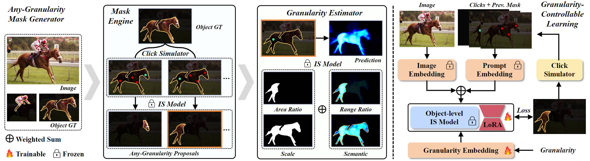
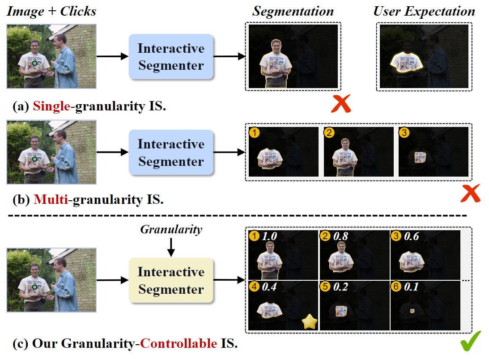

<div style="text-align: center; margin: 10px">
    <h1> ⭐ GraCo: Granularity-Controllable Interactive Segmentation </h1>
</div>
<p align="center">
    <a href="https://zhao-yian.github.io/GraCo"></a>
    <a href="">
    
    </a>
    <a href="https://youtu.be/QE8Mi0k2nKg?si=yJXbYAzTG1qHF_uK">
    </a>
    
    <a href="https://huggingface.co/spaces/zhaoyian01/GraCo">
    
    </a>
    <a href="mailto: zhaoyian.zh@gmail.com">
    
    </a>
</p>



This is the official implementation for our <span style='color: #EB5353;font-weight:bold'>CVPR'24 highlight</span> paper "GraCo: Granularity-Controllable Interactive Segmentation".

## 📣 Updates 🔥🔥🔥

---

- **[2025.1.4]** Add a new type of granularity control signal: _Semantic Phrase_, which is very useful for segmenting specific parts (head segmentation, hand segmentation, etc.).
- **[2025.1.4]** Releases the [weights](./weights/graco), and new training and inference [code](./isegm) that supports both the granularity slider and the semantic phrase.
- **[2025.1.4]** Update the interactive [demo](./interactive_demo) to support two granularity control signals. **The tool can be put directly into practice with open source weights.**
- **[2025.1.4]** Add a novel Multi-grained Mask Trie (MMT) module and an extended Granularity-Controllable Learning (GCL) strategy. 
The former automatically extends the granularity abundance of existing part annotations through heuristic part merging, and the latter achieves efficient scaling and training of two granularity signals through dual-branch LoRA.
The original AGG is split into the Fine-grained Mask Generator (FMG) and the Mask Granularity Estimator (MGE). The FMG is the same as the mask engine of the AGG, and the MGE is responsible for estimating the two types of granularity control signals for each mask.

---


## 💡 Introduction

Current IS pipelines fall into two categories: single-granularity output and multi-granularity output. The latter aims to alleviate the spatial ambiguity present in the former.
However, the multi-granularity output pipeline suffers from limited interaction flexibility and produces redundant results.
We introduce Granularity-Controllable Interactive Segmentation (GraCo), 
a novel approach that allows precise control of prediction granularity by introducing additional parameters 
to input. This enhances the customization of the interactive system and eliminates redundancy while 
resolving ambiguity. 
Nevertheless, the exorbitant cost of annotating multi-granularity masks and the lack of available datasets with granularity annotations make it difficult for models to acquire the necessary guidance to control output granularity.
To address this problem, we design an any-granularity mask generator that exploits the semantic property of the pre-trained IS model to automatically generate abundant mask-granularity pairs without requiring additional manual annotation. 
Based on these pairs, we propose a granularity-controllable learning strategy that efficiently imparts the granularity controllability to the IS model.

<div align="center">
  
</div>

## 🚀 Quick start

### 📍 Install
- Install [torch](https://pytorch.org/get-started/previous-versions/)
```bash
# Install torch (according to your own cuda version, take 11.8 as an example)
pip install torch==2.0.1 torchvision==0.15.2 torchaudio==2.0.2 --index-url https://download.pytorch.org/whl/cu118
```

- Install other dependencies

```bash
# Install other dependencies
pip install -r requirements.txt
```

### 🍇 Our interactive demo

```bash
# running on cpu
python demo.py --checkpoint path/to/weights/sbd_vit_base.pth --lora_checkpoint path/to/GraCo_base_lora.pth --cpu

# running on gpu
python demo.py --checkpoint path/to/weights/sbd_vit_base.pth --lora_checkpoint path/to/GraCo_base_lora.pth --gpu 0

```


### 🏕️ Any-Granularity mask Generator (Optional)

- If you do not use the automatically generated pseudo mask proposals, simply remove `--part_path` in the training command.

```bash
python any_granularity_generator.py --checkpoint weights/simpleclick/sbd_vit_base.pth  \
    --save-path part_output --save-name proposal.pkl --dataset-path /path/to/datasets/SBD/dataset
```

### 🦄 Train and Evaluation

- Download pre-trained weights and place them in `./weights/simpleclick/`

[SimpleClick models](https://drive.google.com/drive/folders/1qpK0gtAPkVMF7VC42UA9XF4xMWr5KJmL?usp=sharing)

- Train

```bash
bash train.sh
```

- Evaluation on Instance-level, Part-level, Out-of-domain benchmarks
```bash
bash eval.sh
```

- Complementarity analysis of two types of granularity control signals
```bash
bash analysis.sh
```

## Acknowledgements
This repository is built upon [SimpleClick](https://github.com/uncbiag/SimpleClick). The project page is built using the template of [Nerfies](https://nerfies.github.io/). 
Thank the authors of these open source repositories for their efforts. And thank the ACs and reviewers for their effort when dealing with our paper.

## ✨ Citation
If you find this repository helpful, please consider citing our paper.

```
@inproceedings{zhao2024graco,
  title={GraCo: Granularity-Controllable Interactive Segmentation},
  author={Zhao, Yian and Li, Kehan and Cheng, Zesen and Qiao, Pengchong and Zheng, Xiawu and Ji, Rongrong and Liu, Chang and Yuan, Li and Chen, Jie},
  booktitle={Proceedings of the IEEE/CVF Conference on Computer Vision and Pattern Recognition},
  pages={3501--3510},
  year={2024}
}
```